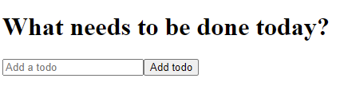
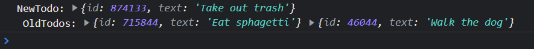
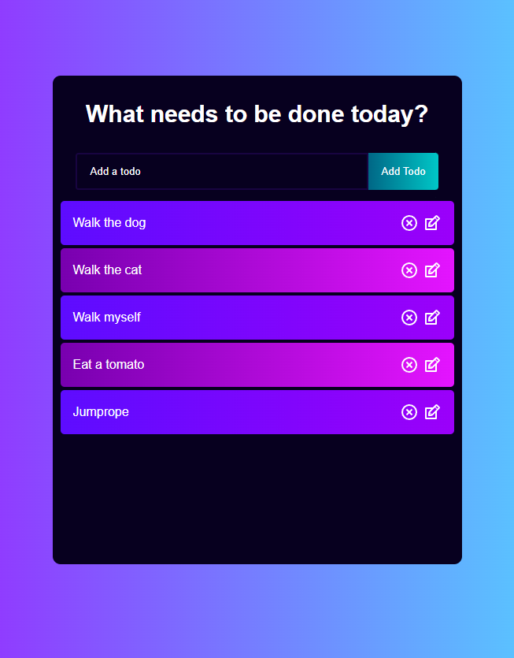

# ToDo App
A todo project is a form of a CRUD app, or Create, Read, Update, and Delete. 
> This is a very common item for people to have within their portfolios

>Throughout this exercise there will be instructions and then an example of what to do. Try and follow the instructions before looking at the example, this will ensure you truly understand what is being done. 

# 0. Create React App
run: `npx create-react-app todo-app`

cd: `todo-app`

Once completed, run: `npm start`

# 1 Lay the foundation by cleaning up and creating files:
> ## 1.1 Delete:
- setupTests
- logo
- app.test.js
- index.css 

> ## 1.2 Clean up App.js
  - Delete the logo import
  - Delete the header and all it's contents and replace it with a `<h1>Todo App</h1>`
  ```js
    <header className="App-header">
      
      <p>
        Edit <code>src/App.js</code> and save to reload.
      </p>
      <a
        className="App-link"
        href="https://reactjs.org"
        target="_blank"
        rel="noopener noreferrer"
      >
        Learn React
      </a>
    </header>
  ```
> ## 1.3 Clean up index.js
- Delete the index.css import
> ## 1.4 Clean up App.css
- Delete everything within this file

> ## 1.5 Create components
1. Right Click `src`
2. Create a folder called `components`
3. Right click `components`
    1. Create Todos.js
    2. Create TodoForm.js
    3. Create TodoList.js

# 2. Update the ToDoForm Component
> ## 2.1  Create a functional component within the `ToDoForm` component
```js
import React from 'react';

export default function TodoForm(){
  return(
    <div>

    </div>
  )
}
```
> ## 2.2. We are also going to be utilizing state - so let's update line 1 to import state
```js
import React, {useState} from 'react';
```
> ## 2.3. Next, below the function declaration let's set up our state hook:
```js
const [input, setInput] = useState('');
```

> ## 2.4. Update the form to:
- It's surrounding `div` should be converted to a `form`
- It should have a className of `todo-form`
- It should contain an `input` of type `text`, with a placeholder of `Add a todo` and a value of `input`, a name of `text` and a className of `todo-input`
- the form should also have a button with a classname of `todo-button` and inner text that says something like `Add todo`

For example:
```js
import React, {useState} from 'react';

export default function TodoForm(){
  const [input, setInput] = useState('');

  return(
    <form className='todo-form'>
      <input
        type='text'
        placeholder='Add a todo'
        value={input}
        name='text'
        className='todo-input'
      />
      <button className='todo-button'>Add todo</button>
    </form>
  )
}
```
> ## 2.5 Import this new component into App.js:
```js
import './App.css';
import TodoForm from './components/TodoForm';

function App() {
  return (
    <div className="App">
      <TodoForm/>
    </div>
  );
}

export default App;
```

# 3. Create functionality
> ## 3.1 Add Todo
If you click the `Add todo` button it will cause our website to reload, therefore we need to create a function that properly handles this button being clicked

Create a function called handleSubmit which takes in an event, and prevents the default behavior (reloading) from happening

For exmple:
```js
const handleSubmit = e => {
  e.preventDefault();
};
```

Give this behaviour to the `form` (right under the `return`)
```js
<form className='todo-form' onSubmit={handleSubmit}>
```

Now click the button again, nothing should happen! 

***Now remember, what we currently have, the input box with the submit button, is ONE `child component` on the `parent TodoList`. We need to hadle properties(`props`) being passed down from that `parent component`.*** 

> ## 3.2 Handle Props
Update the component to receive props

This is the old code:
```js
function TodoForm(){
```

It should be updated to include props
```js
function TodoForm(props){
```
Update the handleSubmit function to handle props
- This is the part of code that will handle properties of newly created components
- Let's make sure that they are unique by randomly generating a number between 1 & 1 million (there are better ways but this works for now)
```js
const handleSubmit = e => {
  e.preventDefault();

  props.onSubmit({
    id: Math.floor(Math.random() * 1000000),
    text: input
  })
}
```
> ### Text Updates
Notice that in this moment we cannot type into the text box - that is because the value of the input box is equal to our `states` `input` that we previously declared. We need to update that input so that our `input` text actually shows. This requires two small changes

Whenever a componenet updates we will need to handle that change:
  - Create a function called `handleChange` 
  - Use this function within the `input`

Example Updates:
```js
// this function is entirely new
const handleChange = e => {
  setInput(e.target.value)
}
```
```js
// this is just an update to the already exisiting input
<input
  type='text'
  placeholder='Add a todo'
  value={input}
  name='text'
  className='todo-input'
  onChange={handleChange}
/>
```

<strong>Notice we can now type. Great!</strong>

Also, if we open the console and then click submit we should see an error. For now let's comment out the `props.onSubmit` that is causing this error and add in a clear for our text.

Our `handleSumbit` function should now look like this:
```js
const handleSubmit = e => {
  e.preventDefault();
  
  // props.onSubmit({
  //   id: Math.floor(Math.random() * 1000000),
  //   text: input
  // })

  setInput('');
}
```
> # 4. Add functionality to TodoList
  ## 4.1 Render the basics of TodoList 
  - This stateful component will utilize the `TodoForm` component as a child component
  - If you can't currently create a react component without a guide please type this out, don't copy paste as you will never learn that way
  ```js
  import React, {useState} from 'react';
  import TodoForm from './TodoForm';

  export default function TodoList(){
    const [todos, setTodos] = useState([]);
    return(
      <div>
        <h1>What needs to be done today?</h1>
        <TodoForm/>
      </div>
    )
  }
  ```

  Notice that nothing has changed

  We now need to update our `App.js` to import this new `TodoList` component which will render many `TodoForm`s

  ## 4.2 Update App.js
  In App.js we need to swap out `TodoForm` with `TodoList`
  
  Our App.js should look like this:
  ```js
  import './App.css';
  import TodoList from './components/TodoList';

  function App() {
    return (
      <div className="App">
        <TodoList />
      </div>
    );
  }

  export default App;
  ```

  Your app should now look similar to this:

  

  ## 4.3 AddTodos
  Create a function called `addTodo`
  - It should take `todo` in as a parameter
  - It should add new `todos` to the existing `todos`
  - For now let's also `console.log` or exisiting and previous `todos`

  ```js
  const addTodo = todo => {
    const newTodos = [todo, ...todos];

    setTodos(newTodos)
    console.log('NewTodo:', todo, `\n`, 'OldTodos:', ...todos)
  }
  ```
  And in our `return` 
  ```js
  <TodoForm onSubmit={addTodo} />
  ```
  
  Return to our `TodoForm.js` & uncomment our `props` code.

  ***Notice that if you check the console and add todos it will show them in the console***

  

> # 5. Create Todo Component
  ## 5.1 What is a Todo comprised of?
  Each todo will 
  - Have an `id` and a `value`
  - Be marked as complete or incomplete

  For example:
  ```js
  import React, {useState} from 'react';
  import TodoForm from './TodoForm';

  export default function Todo(){
    const [edit, setEdit] = useState({
      id: null,
      value: ''
    });

    return todos.map((todo, idx) => {
      <div className={todo.isComplete ? 'todo-row complete' : 'todo-row'} key={idx}>
        <div key={todo.id} onClick={() => completeTodo(todo.id)}>
          {todo.text}
        </div>
        <div className="icons">
        
        </div>
      </div>
    })
  }
  ```

  I'd like to use icons here for each todo, if you'd like to do the same, open a new terminal in the root of your react `todo-app` & run `npm install react-icons`. This will give us access to a library of icons called `react-icons`, view them [here](https://react-icons.github.io/react-icons/).

  Today, we're going to be using `RiCloseCircleLine` & `TiEdit`. We need to import them and use them within the icons div

  ```js
    import { RiCloseCircleLine } from 'react-icons/ri';
    import { TiEdit } from 'react-icons/ti';

    // and within our icons div:
    <div className="icons">
        <RiCloseCircleLine />
        <TiEdit />
    </div>
  ```

  ## 5.2 Use Todo & pass props inside of `TodoList.js`
  Update the return to use the Todo component and pass down two props, `todos` and `completeTodos`

  `todos` already exists, we need to ensure `completeTodos` also exists
  - Create a function that iterates over the todos and modifies them based on if they have been toggled to completed or not
  ```js
  const completeTodo = id => {
    let updatedTodos = todos.map(todo=> {
      if(todo.id === id){
        todo.isComplete = !todo.isComplete;
      }
      return todo;
    })
    setTodos(updatedTodos);
  }
  ```
  
  Your return should now look similar to this
  ```js
  return(
    <div>
      <h1>What needs to be done today?</h1>
      <TodoForm onSubmit={addTodo} />
      <Todos todos={todos} completeTodos={completeTodos}/>
    </div>
  )
  ```

  ***You should notice that you're receiving an error***
  ```js
  ERROR in src\components\Todos.js
  Line 11:10:  'todos' is not defined         no-undef
  Line 13:41:  'completeTodo' is not defined  no-undef
  ```
  Notice where this is originating, not `TodoList.js` - the component we just modified but instead. Which brings us to our next step.

  ## 5.3 Receive the props inside of `Todos.js` 
  We have previously passed data into this component, lets be sure to handle that data by updating the properties of the `Todos.js` function
  
  Updated, `Todos.js` now looks like this:
  ```js
  import React, {useState} from 'react';
  import { RiCloseCircleLine } from 'react-icons/ri';
  import { TiEdit } from 'react-icons/ti';

  export default function Todo({todos, completeTodo}){
    const [edit, setEdit] = useState({
      id: null,
      value: ''
    });

    console.log(todos)

    return todos.map((todo, idx) => (
      <div className={todo.isComplete ? 'todo-row complete' : 'todo-row'} key={idx}>
        <div key={todo.id} onClick={() => completeTodo(todo.id)}>
          {todo.text}
        </div>
        <div className="icons">
          <RiCloseCircleLine />
          <TiEdit />
        </div>
      </div>
    ))
  }
  ```

  Now when we add a new item it should render to the page!

  If this is not the case. Don't just copy paste code. Try and understand what was going wrong - for example I had curly braces around my JSX instead of parenthesis. It's okay to make these mistakes, you need to practice solving them!

  Let's take a breather and reflect upon what we've achieved so far. 
  - We spun up our app
  - We removed extra files
  - We created our components
  - We then added functionality to our TodoForm and our Todo List - here we first got some feedback by console logging our input value
  - We then created our todo component where we receive props and render the component to the page, we also pass props back up to the parent component through a functional prop
  - In short we have completed the Create and Read aspects of CRUD

  Next We will create functionlaity for EDIT (Update) and Delete

> # 6 Updating and Deleting
  ## 6.1 
  Here we'll be working backwards - which will break the app as we're developing
  
  Within `Todos.js` we want to render something a little more specific than 
  ```js
  <RiCloseCircleLine />
  <TiEdit />
  ```
  Let's update these items to have some functionality on click, one will run a function called `removeTodo` and the other `setEdit` which is actually a feature we've previously setup through state. They also will have classnames so that we can style them - respectively `delete-icon` and `edit-icon`

  ```js
  <RiCloseCircleLine 
  onClick={() => removeTodo(todo.id)}
  className='delete-icon'
  />
  <TiEdit 
  onClick={() => setEdit({id: todo.id, value:todo.text})}
  className='edit-icon'
  />
  ```

  Remeber we're working backwards. When clicked these icons do something, edit modifies state, so it's actually good to go. Remove needs to receive a function. This is going to be passed down as a prop. 

  Let's update our function to do so:
  ```js
  export default function Todo({todos, completeTodo, removeTodo}){
  ```

  Notice that clicking edit doesnt do anything, but doesn't cause an error. Clicking the delete, X does throw an error (in the console if you don't see it)

  ## 6.2 Creating the remove function
  Head back to the `TodoList` and create a function called `removeTodo` it should
  - take in an `id` param
  - it will filter through the array to look for the clicked id and remove that item from the array
  - and finally update the existing todos to the updatedTodos

  Within `TodoList` you should have a function similar to the following:
  ```js
  const removeTodo = id => {
    const removeArr = [...todos].filter(todo => todo.id !== id);

    setTodos(removeArr);
  }
  ```

  Lastly we need to make sure that this function and the endpoint are connected by passing `props`

  Again within `TodoList` update the props that are passed into our `Todo` component 
  ```js
  <Todos todos={todos} completeTodo={completeTodo} removeTodo={removeTodo}/>
  ```

  ## 6.3 Creating Update function
  This time we'll work from top-down

  Inside `TodoList.js` let's declare our function called `updateTodo` and within it we are going to do something quite similar. 
  - It takes in a todoId, and a new value
  - It then sets the new todos by iterating over the previous items and, if the id matches, setting our previous item to be our new value

  It should look something like this:
  ```js
  const updateTodo = (todoId, newValue) => {
    setTodos(prev => prev.map(item => (item.id === todoId ? newValue : item)));
  }
  ```

  Next Let's pass the function down as a prop

  ```js
  <Todos todos={todos} completeTodo={completeTodo} removeTodo={removeTodo} updateTodo={updateTodo} />
  ```

  Now in `Todos.js` 

  Firstly we want to updated our parameters to include updateTodo
  ```js
  export default function Todos({todos, completeTodo, removeTodo, updateTodo}){
  ```

  Next we want to create a submitUpdate function it should:
  - take in a value
  - utilize the update function passed down through props, if we recall that function takes in two values, an id & a new value, so we'll pass those through as arguments 
  - next we'll update our state for that item
  ```js
  const submitUpdate = newTodo => {
    updateTodo(edit.id, newTodo)
    setEdit({
      id: null, 
      value: ''
    })
  }
  ```
  The update function within `Todos.js` now looks like this:
  ```js
  const updateTodo = (todoId, newValue) => {
    setTodos(prev => prev.map(item => (item.id === todoId ? newValue : item)));
  }
  ```

  Now we're going to have a new `return` statement wrapped in an `if` statement.
  - `if` edit.id is true
  - `return` a `TodoForm` which, onSubmit runs the submitUpdate function (very similar to our usage of TodoForm in `TodoList.js`)
  - This is our result, it goes above our prior return statement (`return todos.map((todo, idx)...`):
  ```js
  if(edit.id){
    return <TodoForm onSubmit={submitUpdate} />
  }
  ```

  - TodoForm is a component, let's be sure to import it too
  ```js
  import TodoForm from './TodoForm';
  ```

> # 7 Styling and UX (focus)
  Now give our app a spin, we can:
  - Add items
  - Delete items
  - Update items

  Our functionality is somewhat good to go, everything from here on out is refactoring or styling.
  ## 7.1 Focus!
  Our app is only utilized for Todos, we want the user to immediately be ready to input new todos

  We are going to utilize two additional hooks to achieve this.

  The first is `useEffect` - this hook runs as soon as the component is rendered and can immediately put a users focus onto the text box

  The second is `useRef` - this hook it utilized to create a reference to an item on the page (for example the text box)

  Together they allow us to immediately foucus a user onto a specific item

  First let's import them by updating imports in `TodoForm.js`:
  ```js
  import React, {useState, useEffect, useRef} from 'react';
  ```
  Next let's create our `inputRef` hook and initialize it to null:
  ```js
  const inputRef = useRef(null)
  ```
  Now we'll create our `useEffect` hook which looks for our `inputRef` and focuses on it:
  ```js
  useEffect(() => {
    inputRef.current.focus();
  })
  ```
  Lastly, lets ensure to place our reference on the input:
  ```js
  <input
    type='text'
    placeholder='Add a todo'
    value={input}
    name='text'
    className='todo-input'
    onChange={handleChange} 
    ref={inputRef} // this is new
  />
  ```
  Give our page a refresh and you should notice that the focus is in a text box when we refresh a page. Same thing for if we click edit on an existing todo
  # 7.2 Styling
  First let's do global styling, we'll be removing any margin and padding. We'll also set the font family
  ```css
  * {
  margin: 0;
  padding: 0;
  font-family: Arial, Helvetica, sans-serif
  }
  ```
  Next lets set a background color for the body, I'll be using a gradient (pick your own colors, gradient, etc..):
  ```css
  body{
    background: linear-gradient(
      90deg, 
      rgb(144, 59, 255) 0%, 
      rgb(90, 194, 255) 100%
    )
  }
  ```
  Next, let's orient & style our `.App`
  ```css
  .App{
    display: flex;
    flex-direction: column;
    justify-content: start;
    width: 520px;
    min-height: 600px;
    background: #333333;
    text-align: center;
    margin: 100px auto;
    border-radius: 10px;
    padding-bottom: 20px;
  }
  ```
  The `h1` text needs some spacing and styling too
  ```css
  h1{ 
    margin: 32px 0;
    font-size: 30px;
  }
  ``` 
  Next we want to style our complete items (try clicking a component before and after adding this code) - remember we created click functionality which changed the class
  ```css
  .complete {
    text-decoration: line-through;
    opacity: 0.4;
  }
  ```
  Now let's style the input and it's button:
  ```css
  .todo-input {
    padding: 14px 32px 14px 16px;
    border-radius: 4px 0 0 4px;
    border: 2px solid #5d0cff;
    outline: none;
    width: 320px;
    background: transparent;
    color: #fff;
    margin-bottom: 10px;
  }

  .todo-input::placeholder {
    color: white;
  }

  .todo-input:focus {
    border: 2px solid #6f27ff;
  }

  .todo-button {
    padding: 16px;
    border: none;
    border-radius: 0 4px 4px 0;
    cursor: pointer;
    outline: none;
    background: linear-gradient(
      90deg,
      rgb(0, 103, 134) 0%,
      rgb(0, 199, 199) 100%
    );
    color: #fff;
    text-transform: capitalize;
  }

  ```
  We also have some subclasses that need to be styled:
  ```css
  .todo-input.edit {
    border: 2px solid #149fff;
  }

  .todo-button.edit {
    background: linear-gradient(
      90deg,
      rgba(20, 159, 255, 1) 0%,
      rgba(17, 122, 255, 1) 100%
    );
    padding: 16px 22px;
  }
  ```
  Let's now style our exisiting items:
  ```css
  .todo-container {
    display: flex;
    flex-direction: row;
    position: relative;
  }

  .todo-row {
    display: flex;
    justify-content: space-between;
    align-items: center;
    margin: 4px auto;
    color: #fff;
    background: linear-gradient(
      90deg,
      rgba(255, 118, 20, 1) 0%,
      rgba(255, 84, 17, 1) 100%
    );

    padding: 16px;
    border-radius: 5px;
    width: 90%;
  }
  ```
  I'd like to have alternating colors:
  ```css
  .todo-row:nth-child(2n+1) {
    background: linear-gradient(
      90deg,
      rgba(93, 12, 255, 1) 0%,
      rgba(155, 0, 250, 1) 100%
    );
  }
  ```
  Lastly, lets update our icons:
  ```css
  .icons {
    display: flex;
    align-items: center;
    font-size: 24px;
    cursor: pointer;
  }

  .delete-icon {
    margin-right: 5px;
    color: #fff;
  }

  .edit-icon {
    color: #fff;
  }
  ```

# Finished!
Your app should now look something similar to this:
